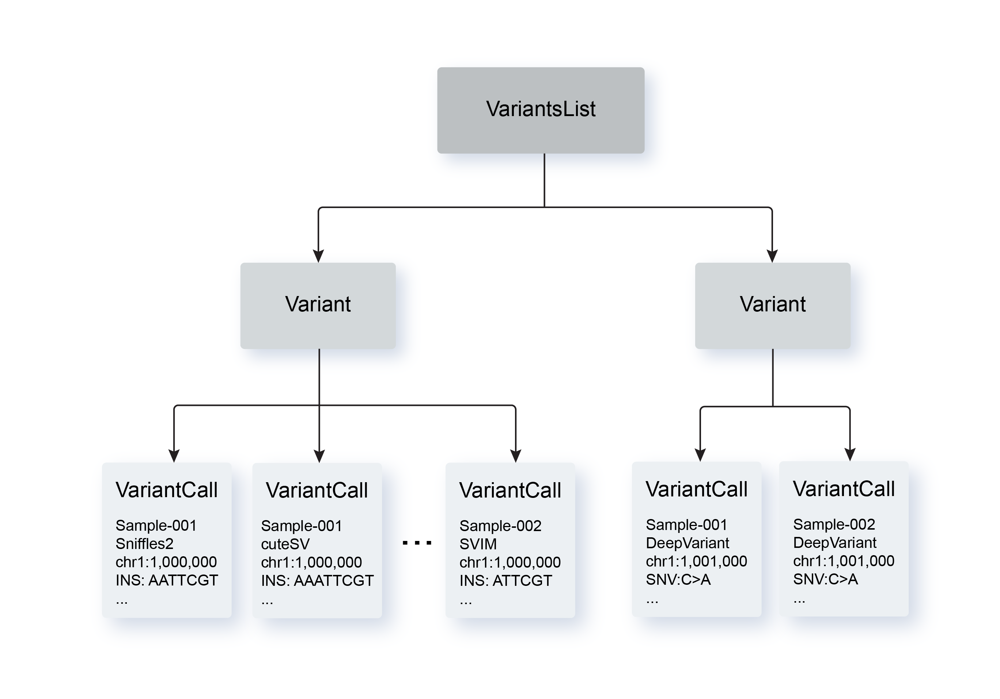

This command converts a VCF (variant call format) file to a TSV (tab-separated values) file. Please refer to the [Variants TSV](variants_list_tsv_file.qmd) for more information on the headers found in a `Exacto` converted TSV file.

```bash
usage: exacto vcf-to-tsv [-h] 
    --vcf-file VCF_FILE 
    --variant-calling-method VARIANT_CALLING_METHOD
    --sequencing-platform SEQUENCING_PLATFORM 
    --source-id SOURCE_ID
    --output-tsv-file OUTPUT_TSV_FILE

required arguments:
  --vcf-file VCF_FILE                               # Input VCF file.
  --variant-calling-method VARIANT_CALLING_METHOD   # Variant calling method.
                                                    # Allowed options: 
                                                    # gatk4-mutect2, 
                                                    # deepvariant,
                                                    # strelka2,
                                                    # sniffles2,
                                                    # svim,
                                                    # cutesv,
                                                    # delly2,
                                                    # lumpy,
                                                    # pbsv.
  --sequencing-platform SEQUENCING_PLATFORM         # Sequencing platform (e.g. 'pacbio').
  --source-id SOURCE_ID                             # Source ID (e.g. patient ID or cell line ID).
  --output-tsv-file OUTPUT_TSV_FILE                 # Output TSV file.
```

| Required Parameter         | Description                                |
| -------------------------- | ------------------------------------------ |
| `--vcf-file`               | VCF file (full path)                       |
| `--variant-calling-method` | Variant calling method. The latest version of `Exacto` currently supports conversion from the following variant callers: 'gatk4-mutect2', 'deepvariant', 'strelka2', 'sniffles2', 'svim', 'cutesv', 'delly2', 'lumpy', 'pbsv'. |
| `--sequencing-platform`    | Sequencing platform (e.g. 'pacbio', 'ont', or 'illumina'). Any string value is accepted for this parameter. |
| `--source-id`              | Source ID (e.g. patient ID) |
| `--output-tsv-file`        | Output TSV file (full path) |


## Notes on Variant Types

### Deletions
For `DEL` (deletion), `position_1` is the start position of the deletion (i.e. the first position of the deleted segment) and `position_2` is the end position of the deletion (i.e. the last position of the deleted segment). In other words, the DNA/RNA segment from `position_1` to `position_2` (inclusive) corresponds to the deleted DNA/RNA segment.

### Insertions
For `INS` (insertion), the insertion sequence is found immediately after `position_1`. The value for `position_2` is the same as `position_1` and the value for `chromosome_2` is the same as `chromosome_1`.

## Hierarchy of Variants and Variant Calls



As shown above, a `VariantsList` object stores one or more `Variant` objects, while a `Variant` object stores one or more `VariantCall` objects. This representation of variant allows for variant calls of the same mutation from various calling methods to be represented as single variant. Additionally, two or more `VariantsList` objects can be merged into one `VariantsList` object and the resulting `VariantsList` object can be filtered. For more details on how to perform `merge` and `filter` operations on a `VariantsList`, check out [here](python_api.qmd)
